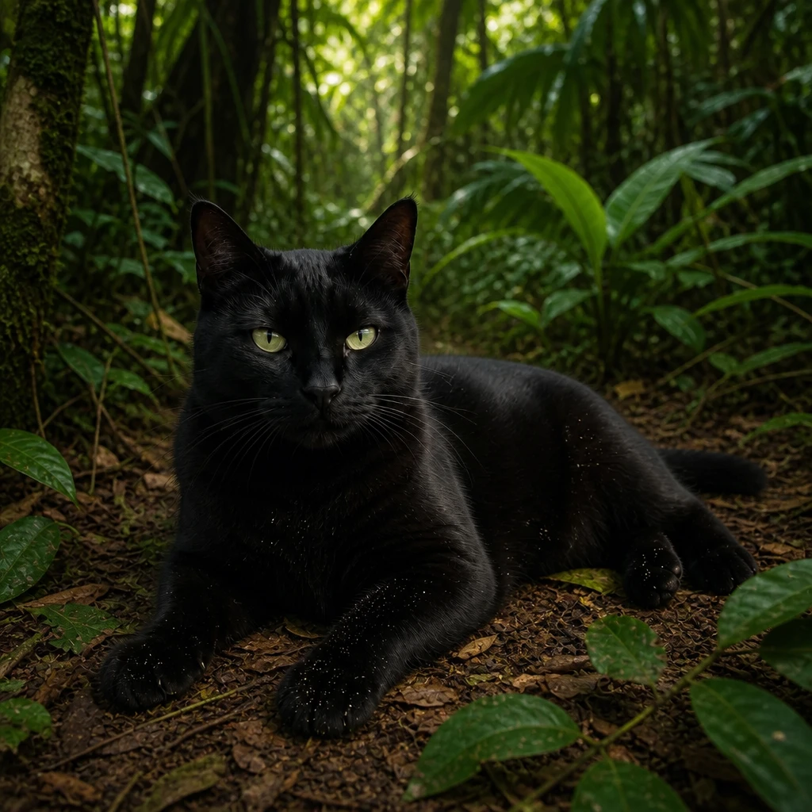
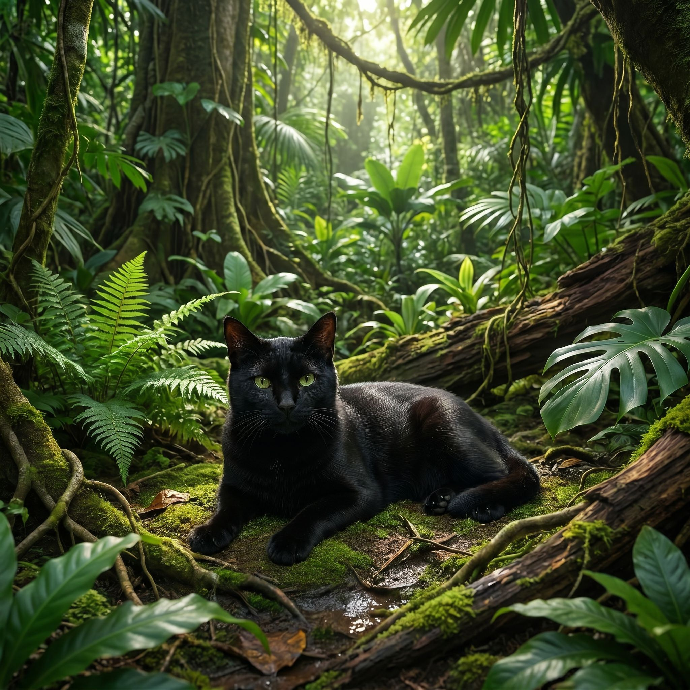
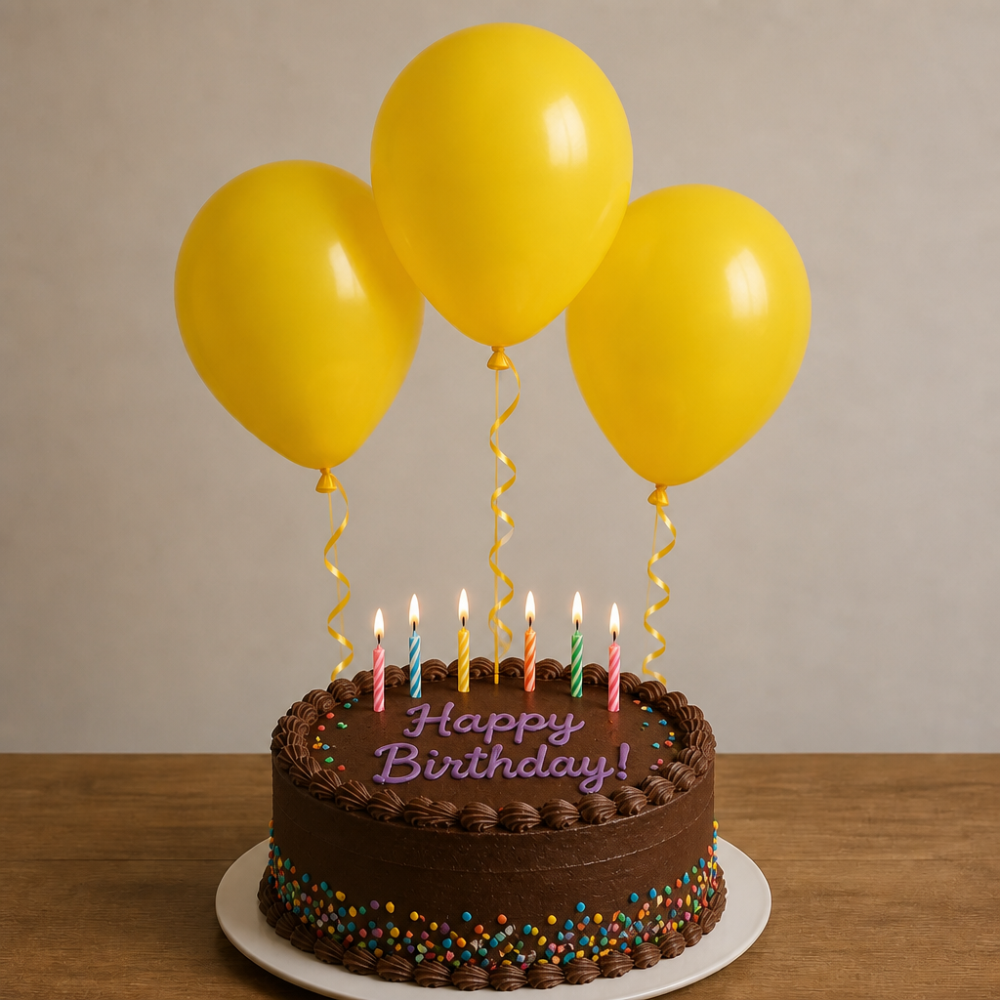
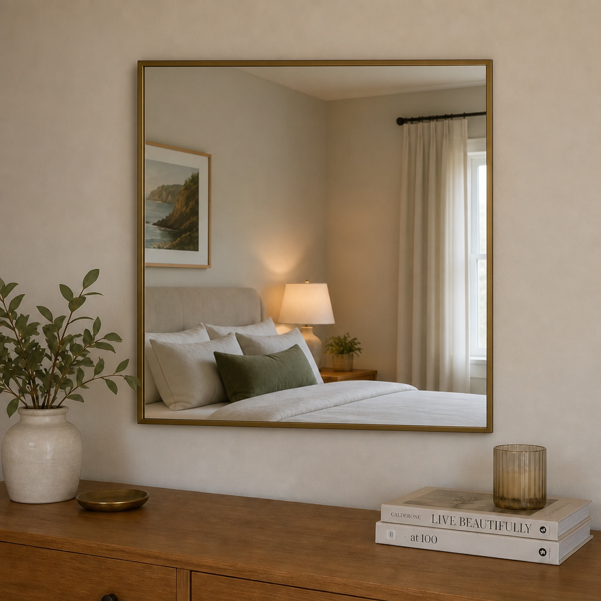
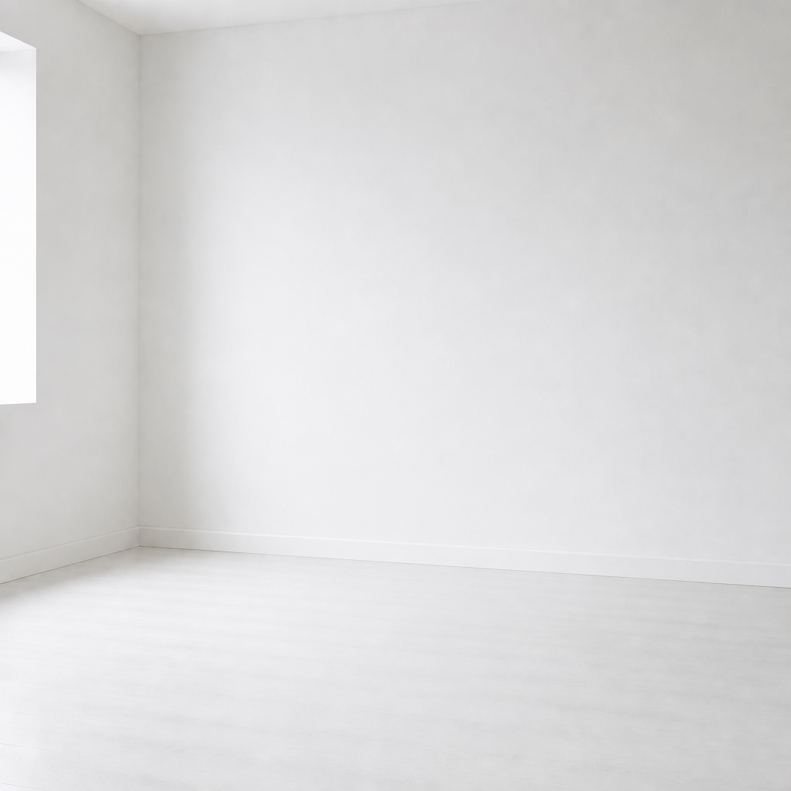
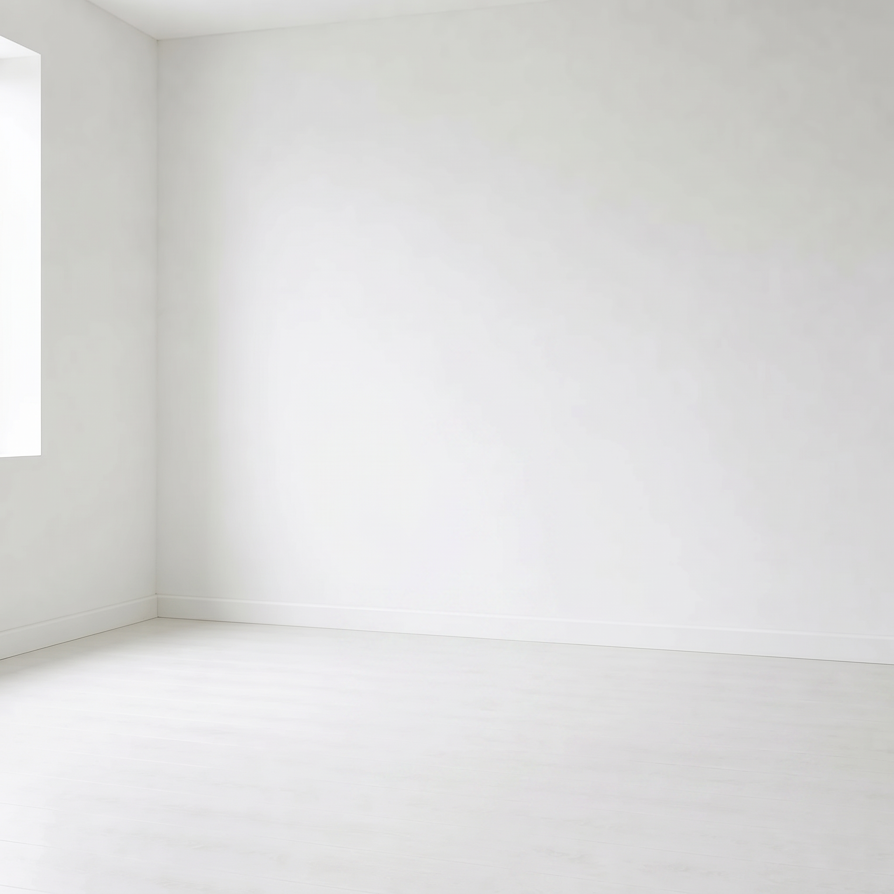
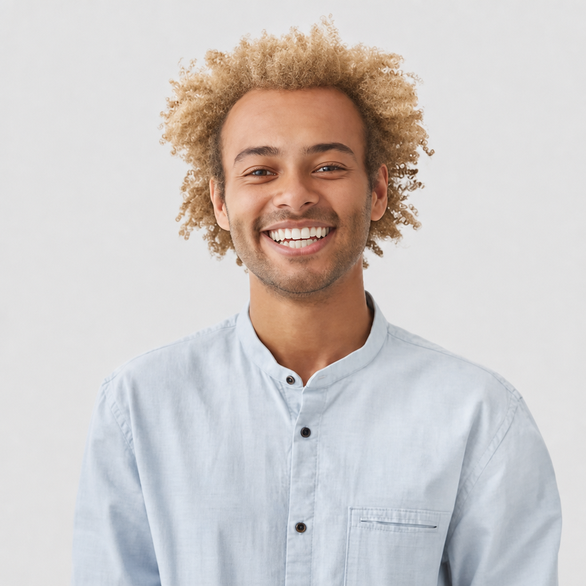

# Image edits — GPT Image 2 vs Nano Banana Pro

Each input image was edited with the listed prompt and run through **both** models
(`openai/gpt-image-2` and `google/nano-banana-pro`) via the Replicate API.

Naming convention: `<edit-description>__<model>.png`

## Summary

| # | Edit | Prompt | Input | GPT Image 2 output | Nano Banana Pro output |
|---|------|--------|-------|--------------------|------------------------|
| 1 | Cat → jungle | `Edit the image so the cat is in a jungle instead.` | `inputs/black-cat-on-beach.png` | `cat-in-jungle__gpt-image-2.png` | `cat-in-jungle__nano-banana-pro.png` |
| 2 | Cake → chocolate | `Change the cake to a chocolate cake.` | `outputs/three-yellow-balloons-birthday-cake.png` | `chocolate-cake__gpt-image-2.png` | `chocolate-cake__nano-banana-pro.png` |
| 3 | Mirror → square | `Make the mirror's shape square.` | `inputs/round-mirror-on-bedroom-wall.png` | `square-mirror__gpt-image-2.png` | `square-mirror__nano-banana-pro.png` |
| 4 | Remove the chair | `remove the chair from the image.` | `inputs/wooden-chair-empty-room.png` | `removed-chair__gpt-image-2.png` | `removed-chair__nano-banana-pro.png` |
| 5 | Hair → blond | `Make his hair blond` | `inputs/afro-student.png` * | `blond-hair__gpt-image-2.png` | `blond-hair__nano-banana-pro.png` |

\* The original input for #5 was `inputs/happy-man-student-with-afro-hairdo-shows-white-teeth-being-good-mood-after-classes_273609-16608.avif`, converted to `inputs/afro-student.png` before editing (the models don't reliably accept AVIF).

---

## 1. Cat → jungle

**Prompt:** `Edit the image so the cat is in a jungle instead.`

| Input | GPT Image 2 | Nano Banana Pro |
|-------|-------------|-----------------|
|  |  |  |

## 2. Cake → chocolate

**Prompt:** `Change the cake to a chocolate cake.`

| Input | GPT Image 2 | Nano Banana Pro |
|-------|-------------|-----------------|
|  |  |  |

## 3. Mirror → square

**Prompt:** `Make the mirror's shape square.`

| Input | GPT Image 2 | Nano Banana Pro |
|-------|-------------|-----------------|
|  |  |  |

## 4. Remove the chair

**Prompt:** `remove the chair from the image.`

| Input | GPT Image 2 | Nano Banana Pro |
|-------|-------------|-----------------|
|  |  |  |

## 5. Hair → blond

**Prompt:** `Make his hair blond`

| Input | GPT Image 2 | Nano Banana Pro |
|-------|-------------|-----------------|
|  |  |  |

---

> Note: Nano Banana Pro outputs carry an invisible SynthID watermark and are larger files (~4–5 MB) than the GPT Image 2 outputs (~1–1.4 MB).
