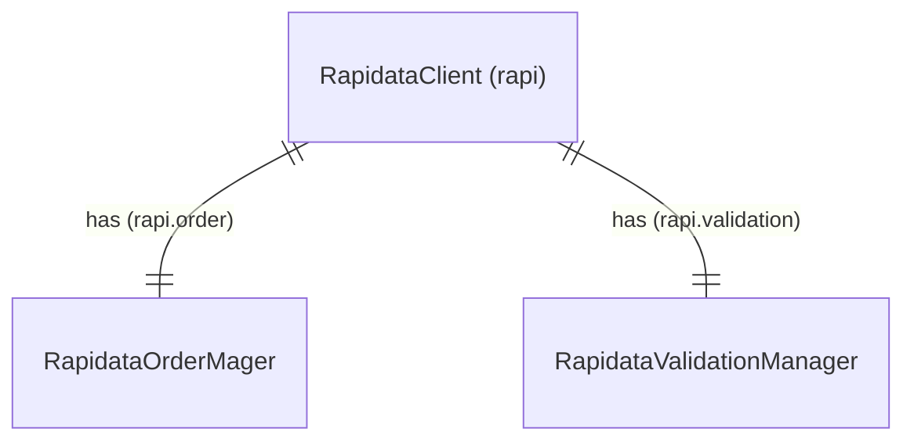

[RapidataClient](reference/rapidata/rapidata_client/rapidata_client.md) - instantiated as "rapi" in the examples

[RapidataOrderManger](reference/rapidata/rapidata_client/order/rapidata_order_manager.md) - accessible through the RapidataClient(rapi) under rapi.order

[RapidataValidationManger](reference/rapidata/rapidata_client/validation/validation_set_manager.md) - accessible through the RapidataClient(rapi) under rapi.validation
