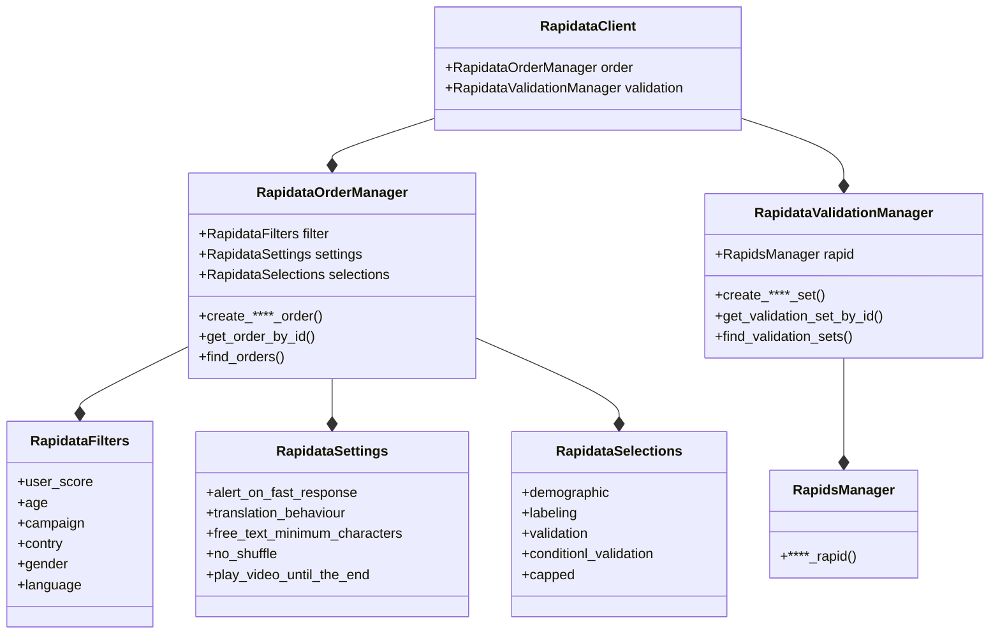

# Rapidata API

The Rapidata API builds on the [RapidataClient](reference/rapidata/rapidata_client/rapidata_client.md) class. This class is the entry point for all operations. The RapidataClient class has two main properties, order and validation, which are used to manage orders and validation sets respectively.

### Order related classes

[RapidataOrderManger](reference/rapidata/rapidata_client/order/rapidata_order_manager.md) - accessible through the RapidataClient(rapi) under rapi.order

[RapidataFilters](reference/rapidata/rapidata_client/filter/rapidata_filters.md) - accessible through the RapidataClient(rapi) under rapi.order

[RapidataSettings](reference/rapidata/rapidata_client/settings/rapidata_settings.md) - accessible through the RapidataClient(rapi) under rapi.order

[RapidataSelections](reference/rapidata/rapidata_client/selection/rapidata_selections.md) - accessible through the RapidataClient(rapi) under rapi.order

### Validation related classes

[RapidataValidationManger](reference/rapidata/rapidata_client/validation/validation_set_manager.md) - accessible through the RapidataClient(rapi) under rapi.validation

[RapidsManager](reference/rapidata/rapidata_client/validation/rapids/rapids_manager.md) - accessible through the RapidataClient(rapi) under rapi.validation
