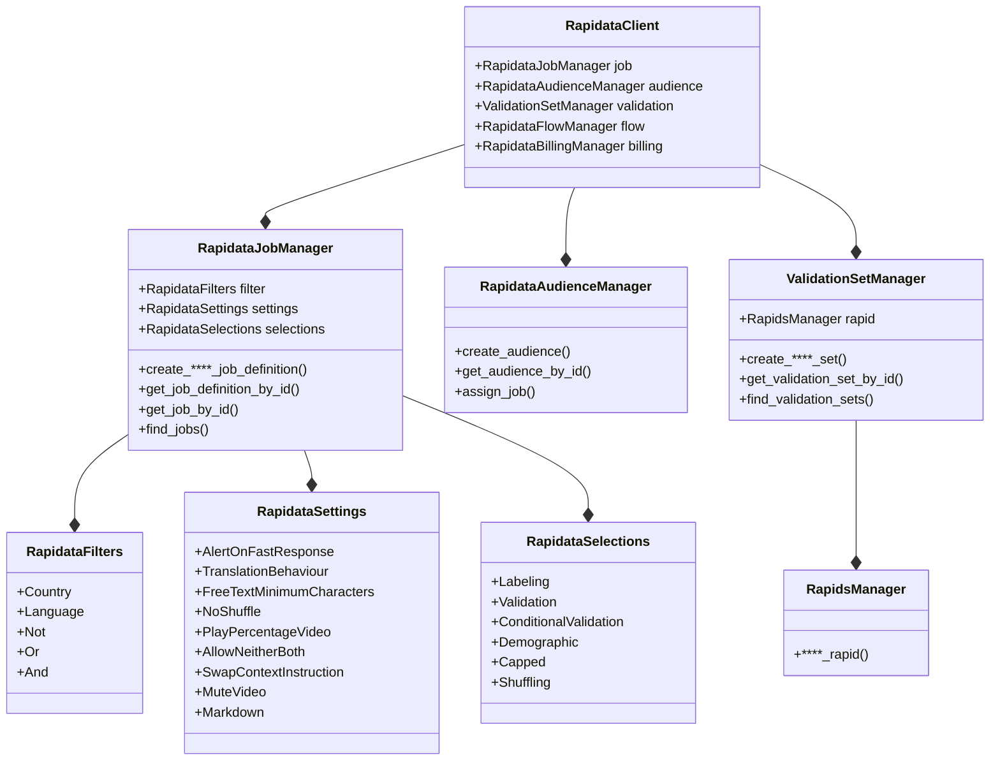

```mermaid
classDiagram
    class RapidataClient {
        +RapidataJobManager job
        +RapidataAudienceManager audience
        +ValidationSetManager validation
        +RapidataFlowManager flow
        +RapidataBillingManager billing
    }

    class RapidataJobManager {
        +RapidataFilters filter
        +RapidataSettings settings
        +RapidataSelections selections
        +create_****_job_definition()
        +get_job_definition_by_id()
        +get_job_by_id()
        +find_jobs()
    }

    class RapidataAudienceManager {
        +create_audience()
        +get_audience_by_id()
        +assign_job()
    }

    class ValidationSetManager {
        +RapidsManager rapid
        +create_****_set()
        +get_validation_set_by_id()
        +find_validation_sets()
    }

    class RapidataFilters {
        +Country
        +Language
        +Not
        +Or
        +And
    }

    class RapidataSettings {
        +AlertOnFastResponse
        +TranslationBehaviour
        +FreeTextMinimumCharacters
        +NoShuffle
        +PlayPercentageVideo
        +AllowNeitherBoth
        +SwapContextInstruction
        +MuteVideo
        +Markdown
    }

    class RapidataSelections {
        +Labeling
        +Validation
        +ConditionalValidation
        +Demographic
        +Capped
        +Shuffling
    }

    class RapidsManager {
        +****_rapid()
    }

    RapidataClient --* RapidataJobManager
    RapidataClient --* RapidataAudienceManager
    RapidataClient --* ValidationSetManager
    RapidataJobManager --* RapidataFilters
    RapidataJobManager --* RapidataSettings
    RapidataJobManager --* RapidataSelections
    ValidationSetManager --* RapidsManager

    link RapidataClient "../reference/rapidata/rapidata_client/rapidata_client/" ""
    link RapidataJobManager "../reference/rapidata/rapidata_client/job/rapidata_job_manager/" ""
    link ValidationSetManager "../reference/rapidata/rapidata_client/validation/validation_set_manager/" ""
    link RapidataFilters "../reference/rapidata/rapidata_client/filter/rapidata_filters/" ""
    link RapidataSettings "../reference/rapidata/rapidata_client/settings/rapidata_settings/" ""
    link RapidataSelections "../reference/rapidata/rapidata_client/selection/rapidata_selections/" ""
    link RapidsManager "../reference/rapidata/rapidata_client/validation/rapids/rapids_manager/" ""

```

# Rapidata API

The Rapidata API builds on the [RapidataClient](reference/rapidata/rapidata_client/rapidata_client.md) class. This class is the entry point for all operations. You collect labels by creating a **job definition** with `job`, then assigning it to an **audience** — the job runs against that audience's annotators and produces results.

### Job related classes

[RapidataJobManager](reference/rapidata/rapidata_client/job/rapidata_job_manager.md) - accessible through the RapidataClient(rapi) under rapi.job. Creates job definitions and looks up jobs.

[RapidataAudienceManager](reference/rapidata/rapidata_client/audience/rapidata_audience_manager.md) - accessible through the RapidataClient(rapi) under rapi.audience. Manages annotator audiences and assigns job definitions to them.

[RapidataFilters](reference/rapidata/rapidata_client/filter/rapidata_filters.md) - accessible through the RapidataClient(rapi) under rapi.job

[RapidataSettings](reference/rapidata/rapidata_client/settings/rapidata_settings.md) - accessible through the RapidataClient(rapi) under rapi.job

[RapidataSelections](reference/rapidata/rapidata_client/selection/rapidata_selections.md) - accessible through the RapidataClient(rapi) under rapi.job

### Validation related classes

[RapidataValidationManger](reference/rapidata/rapidata_client/validation/validation_set_manager.md) - accessible through the RapidataClient(rapi) under rapi.validation

[RapidsManager](reference/rapidata/rapidata_client/validation/rapids/rapids_manager.md) - accessible through the RapidataClient(rapi) under rapi.validation.rapid. Used to create specific rapids to be added to a validation set.
