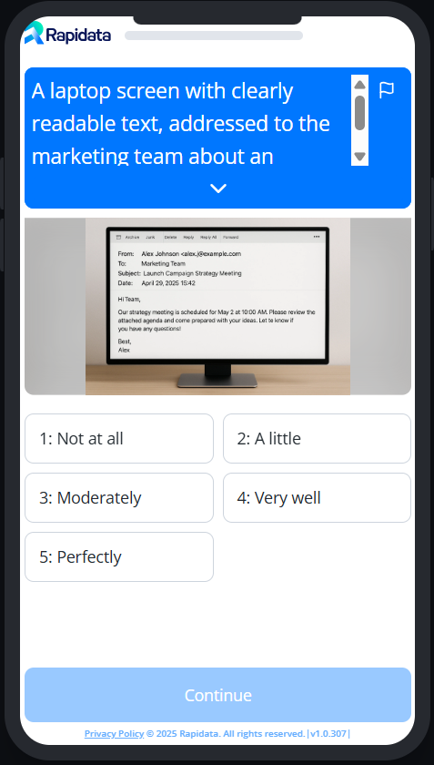

# Example Classify Order

To learn about the basics of creating an order, please refer to the [quickstart guide](../quickstart.md).

{ width="20%" }

=== "Basic"

    With this order, we want to rate different images based on a Likert scale to better understand how well the model generated the images we intended. We have various images that we want to evaluate, and we will assess how accurately they represent the desired concepts. When you run this with your own examples, you may use local paths to your images instead of the URLs.

    The `NoShuffle` setting is used to ensure that the answer options remain in a fixed order, because the answer options are ordered.

    ```python
    --8<-- "examples/basic_classify_order_image.py"
    ```

    To preview the order and see what the annotators see, you can run the following code:

    ```python
    order.preview()
    ```

    To open the order in the browser, you can run the following code:

    ```python
    order.view()
    ```

=== "Advanced"
    In the advanced example we will first create a validation set to give the annotators a reference how they should rate the images.

    To get a better understanding of validation sets, please refer to the [Improve Quality](/improve_order_quality/) guide.

    ```python
    --8<-- "examples/advanced_classify_order.py"
    ```

    To preview the order and see what the annotators see, you can run the following code:

    ```python
    order.preview()
    ```

    To open the order in the browser, you can run the following code:

    ```python
    order.view()
    ```
