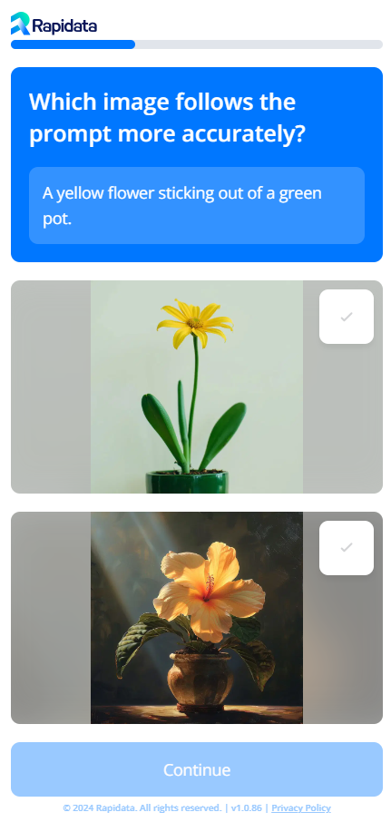

# Example Compare Order

This example builds on what was introduced in the [Quickstart](/quickstart/) as well as the [Improve Quality](/improve_order_quality/) guide.

## Order description

In this example we want to compare two state-of-the-art image-to-text models, Flux and Midjourney, that have generated images based on a description, aka prompt.
Those images have been saved to a public URL in order to be able to run the example anywhere. When you run this with your own examples, you may use local paths to your images instead of the URLs.

We now want to find out which of the images more closely aligns with the prompt.

```python
--8<-- "examples/compare_prompt_image_alignment.py"
```

The resulting rapids for the users look like this:

<figure markdown="span">
{ width="50%" }
</figure>
