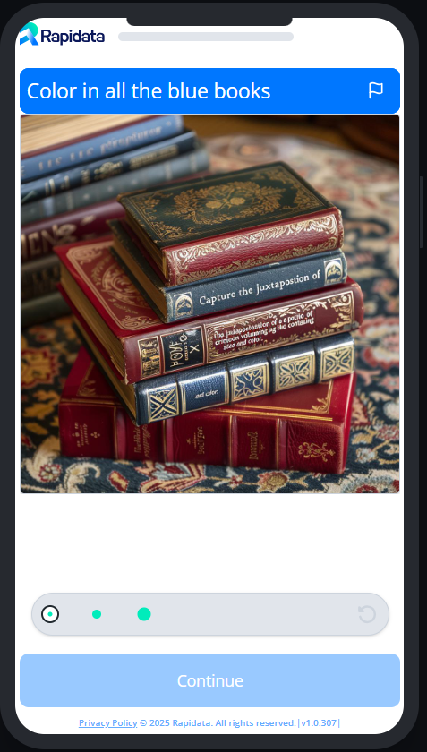

# Example Draw Order

To learn about the basics of creating an order, please refer to the [quickstart guide](../quickstart.md).

{ width="20%" }

A powerful new capability of image generation models is their ability to edit images. But how do these models understand the location and size of objects they need to edit? In this example, we will create an order where annotators color in the object in images, providing training data that helps the model learn where to apply its edits.

```python
--8<-- "examples/basic_draw_order.py"
```

To preview the order and see what the annotators see, you can run the following code:

```python
order.preview()
```

To open the order in the browser, you can run the following code:

```python
order.view()
```
