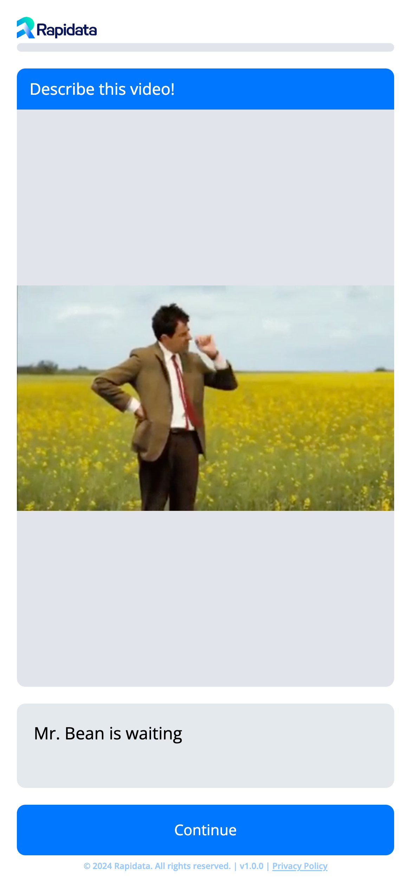

- **Client Setup**

  ***

  The recommended way to set up the Rapidata Client from environment variables

  [:octicons-arrow-right-24: Let's go](./setup_client.md)

- **Classify Order**

  ***

  The user is given mutliple answer options for the given question and image.

  <figure markdown="span">
  { width="60%" }
  </figure>

  [:octicons-arrow-right-24: Let's go](./classify_order.md)

- **Compare Order**

  ***

  The user chooses between two images/videos based on a criteria.

  <figure markdown="span">
  { width="60%" }
  </figure>

  [:octicons-arrow-right-24: Let's go](./compare_order.md)

- **Free Text Order**

  ***

  The user has a keyboard pop up to freely answer anything.

  <figure markdown="span">
  { width="60%" }
  </figure>

  [:octicons-arrow-right-24: Let's go](./free_text_order.md)

- **Transcription Order**

  ***

  Play a video and have users click the words they hear or don't hear.

  <figure markdown="span">
  { width="60%" }
  </figure>

  [:octicons-arrow-right-24: Let's go](./transcription_order.md)

- **Preference Data for RLHF**

  ***

  Longer, more detailed blog post on how to use a compare-style setup to collect human preference data, e.g. for Reinforcement Learning from Human Feedback (RLHF).

  <figure markdown="span">
  { width="80%" }
  </figure>

  [:octicons-arrow-right-24: Let's go](https://rapidata.ai/blog/preference-dataset-demo)

