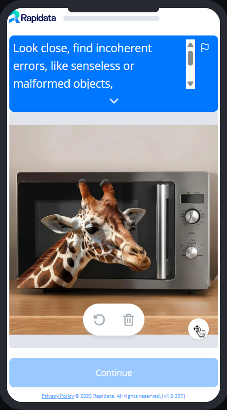

# Example Locate Order

To learn about the basics of creating an order, please refer to the [quickstart guide](../quickstart.md).

{ width="20%" }

A big part of image generation is to make coherent images without any visual glitches. Rapidata makes it easy to get feedback on what parts of the image the model messed up. In this example, we will create an order where annotators are asked to select the parts of the image where there are visual glitches.

```python
--8<-- "examples/basic_locate_order.py"
```

To preview the order and see what the annotators see, you can run the following code:

```python
order.preview()
```

To open the order in the browser, you can run the following code:

```python
order.view()
```
