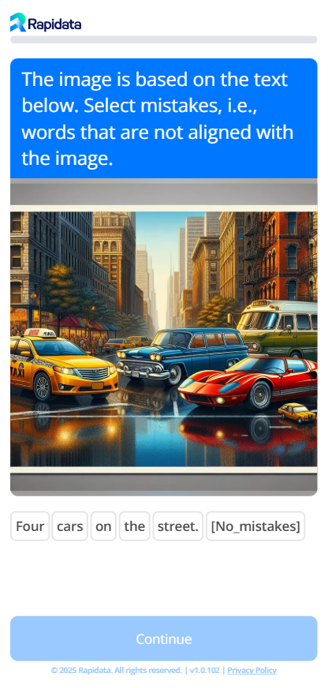

<div style="display: flex; justify-content: space-between; align-items: center;">
  <h1 style="margin: 0;">Rapidata developer documentation</h1>
  <a href="https://www.python.org/downloads/">
    
  </a>
</div>

## Developer Quickstart
Set up your environment and make your first API request in minutes.

<div class="grid cards" markdown>

-   __Developer Quickstart__

    ---

    The user is given mutliple answer options for the given question and image.

    *Estimated time: 5 minutes*

    ```python
    pip install -U rapidata
    ```

    ```python
    from rapidata import RapidataClient

    rapi = RapidataClient()

    order = rapi.order.create_compare_order(
        name="Example Alignment Order",
        instruction="Which image matches the description better?",
        contexts=["A small blue book sitting on a large red book."],
        datapoints=[["https://assets.rapidata.ai/midjourney-5.2_37_3.jpg", 
                    "https://assets.rapidata.ai/flux-1-pro_37_0.jpg"]],
    ).run()

    order.display_progress_bar()

    results = order.get_results()
    print(results)
    ```
    
    [:octicons-arrow-right-24: Let's go](quickstart.md)

</div>

<div class="grid cards" markdown>

-   __Classify Order__

    ---

    The user is given mutliple answer options for the given question and image.

    <figure markdown="span">
    { width="60%" }
    </figure>

    [:octicons-arrow-right-24: Let's go](./examples/classify_order.md)

-   __Compare Order__

    ---

    The user chooses between two images/videos/texts based on a criteria.

    <figure markdown="span">
    { width="60%" }
    </figure>

    [:octicons-arrow-right-24: Let's go](./examples/compare_order.md)

-   __Free Text Order__

    ---

    The user has a keyboard pop up to freely answer anything.

    <figure markdown="span">
    { width="60%" }
    </figure>

    [:octicons-arrow-right-24: Let's go](./examples/free_text_order.md)

-   __SelectWords Order__

    ---

    Have the users click on words in a text depending on a condition.

    <figure markdown="span">
    { width="60%" }
    </figure>

    [:octicons-arrow-right-24: Let's go](./examples/select_faulty_prompt_order.md)

</div>

<div class="grid cards" markdown>

-   __Preference Data for RLHF__

    ---

    Longer, more detailed blog post on how to use a compare-style setup to collect human preference data, e.g. for Reinforcement Learning from Human Feedback (RLHF).

    <figure markdown="span">
    { width="80%" }
    </figure>

    [:octicons-arrow-right-24: Let's go](https://www.rapidata.ai/guides/preference-dataset-demo)

</div>
