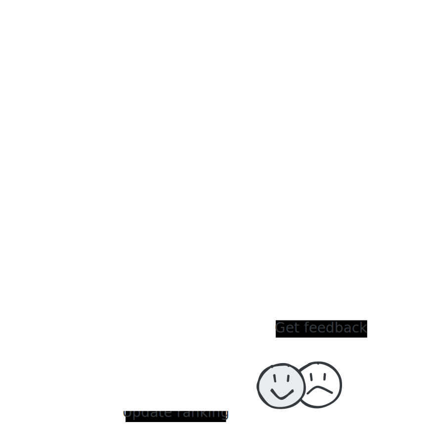

# Model Ranking Insights

## Overview

Model Ranking Insights (MRI) provides a powerful way to compare and rank different AI models based on their performance on specific tasks. They allow you to create standardized evaluation environments where multiple models can be tested against each other and ranked based on human feedback.



## How to use MRI

### 1. Benchmark Creation
You start by creating a benchmark with specific settings:

- **Name**: Identifies your benchmark in the overview
- **Prompts**: A list of prompts that will be used to generate the media to evaluate the models.

Use the `RapidataClient` to authenticate yourself and create a new leaderboard:

```python
from rapidata import RapidataClient

# Initialize the client
# Running this the first time will open a browser window and ask you to login
client = RapidataClient() 

# Create a new benchmark
benchmark = client.mri.create_new_benchmark(
    name="AI Art Competition",
    prompts=[
        "A serene mountain landscape at sunset",
        "A futuristic city with flying cars",
        "A portrait of a wise old wizard"
    ]
)
```
### 2. Leaderboard Creation
Once your benchmark is set up, you can create leaderboards for it.

- **Name**: Identifies your leaderboard in the overview
- **Instruction**: The criteria upon which labelers choose the better model
- **Show Prompt**: Whether to display the prompt to evaluators. Including this option adds complexity and cost, so it is advised to only include it in settings where the prompt is necessary for the labelers to follow the instruction (e.g., prompt alignment).

> **Note:** You can find all leaderboards for a benchmark by using the `leaderboards` attribute of the benchmark.


```python
# Create a new leaderboard on a benchmark
leaderboard = benchmark.create_leaderboard(
    name="Realism", 
    instruction="Which image is more realistic?", 
    show_prompt=False
)

```

### 3. Model Evaluation
Once your benchmark and leaderboard are set up, you can evaluate models by the following:

- **Media**: Images, videos, or audio files generated by your model
- **Prompts**: Each media file must be paired with a prompt

All prompts must be from the benchmark's registered prompt set (available through the `prompts` attribute of the benchmark)

> **Note:** You are not limited to one media per prompt; you can supply the same prompt multiple times.


```python
# Evaluate a model
benchmark.evaluate_model(
    name="MyAIModel_v2.1",
    media=[
        "https://assets.rapidata.ai/mountain_sunset1.png",
        "https://assets.rapidata.ai/mountain_sunset2.png",
        "https://assets.rapidata.ai/futuristic_city.png", 
        "https://assets.rapidata.ai/wizard_portrait.png"
    ],
    prompts=[
        "A serene mountain landscape at sunset",
        "A serene mountain landscape at sunset",
        "A futuristic city with flying cars",
        "A portrait of a wise old wizard"
    ]
)
```

### 4. Matchmaking and Ranking
MRI creates fair comparisons by:

- **Prompt-based matching**: Only media with the same prompt are compared against each other
- **Mixed evaluation**: New models are matched up with existing models to maximize the information gained
- **User-driven assessment**: Human evaluators compare model outputs based on the instruction to determine rankings

### 5. Results and Visibility
Your leaderboard results are:

- **Directly viewable** on the Rapidata dashboard at [app.rapidata.ai/mri/benchmarks](https://app.rapidata.ai/mri/benchmarks)
- **Continuously updated** as new models are added and evaluated
- **Provides deeper insights** into model performances over time

### Retrieving Existing Benchmarks

You can retrieve benchmarks by ID or search for them:

```python
# Get a specific benchmark by ID
benchmark = client.mri.get_benchmark_by_id("benchmark_id_here")

# Find benchmarks by name
recent_benchmarks = client.mri.find_benchmarks(
    name="AI Art",
    amount=10
)
```

### Retrieving Results

```python
# Get the leaderboard
leaderboard = benchmark.leaderboards[0]

# Get the standings
standings = leaderboard.get_standings() # Returns a pandas dataframe
```
