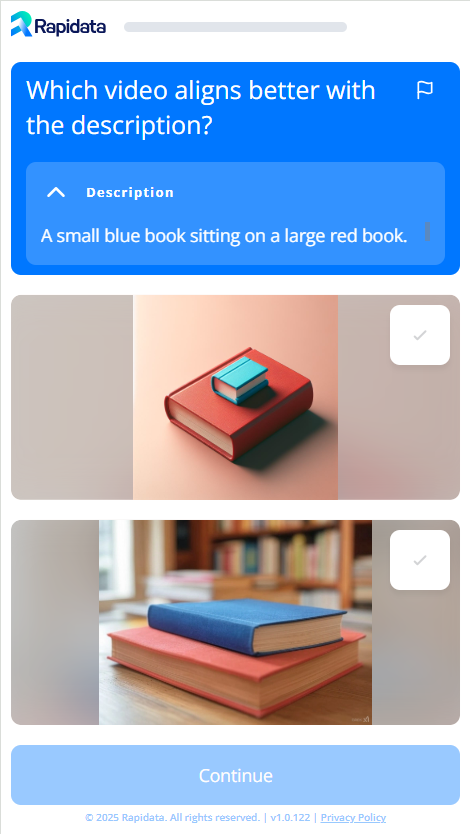

# Quickstart Guide

Directly ask real humans to compare your data. This guide will show you how to create a compare order using the Rapidata API.

There are many other types of orders you can create which you can find in the examples on the [Overview](index.md).

We will create an order assessing image-prompt-alignment, using 2 AI generated images and compare them against each other based on which image followed the prompt more accurately.

Our annotators will then label the data according to the instruction we provided.

They see the following screen:

{ width="40%" }

## Installation

Install Rapidata using pip:

```
pip install -U rapidata
```


## Usage

Orders are managed through the [`RapidataClient`](reference/rapidata/rapidata_client/rapidata_client.md#rapidata.rapidata_client.rapidata_client.RapidataClient).

Create a client as follows, this will save your credentials in your `~/.config/rapidata/credentials.json` file so you don't have to log in again on that machine:

```py
from rapidata import RapidataClient

#The first time executing it on a machine will require you to log in
rapi = RapidataClient()
```

Alternatively you can generate a Client ID and Secret in the [Rapidata Settings](https://app.rapidata.ai/settings/tokens) and pass them to the [`RapidataClient`](reference/rapidata/rapidata_client/rapidata_client.md#rapidata.rapidata_client.rapidata_client.RapidataClient) constructor:

```py
from rapidata import RapidataClient
rapi = RapidataClient(client_id="Your client ID", client_secret="Your client secret")
```

### Creating an Order

All order-related operations are performed using rapi.order.

Here we create a compare order with a name and the instruction / question we want to ask. Additionally, we provide the prompt as context:

```py
order = rapi.order.create_compare_order(
    name="Example Alignment Order",
    instruction="Which image matches the description better?",
    contexts=["A small blue book sitting on a large red book."],
    datapoints=[["https://assets.rapidata.ai/midjourney-5.2_37_3.jpg", 
                "https://assets.rapidata.ai/flux-1-pro_37_0.jpg"]],
)
```
> **Note:** When calling this function the data gets uploaded and prepared, but no annotators will start working on it yet.

The parameters are as follows:

- `name`: The name of the order. This is used to identify the order in the [Rapidata Dashboard](https://app.rapidata.ai/dashboard/orders). This name is also be used to find the order again later.
- `instruction`: The instruction you want to show the annotators to select the image by.
- `contexts`: The prompt that will be shown along side the two images and the instruction. (optional parameter)
- `datapoints`: The image pairs we want to compare (order is randomized for every annotator). This can be any public URL (that points to an image, video or audio) or a local file path. This is a list of all datapoints you want to compare. Each datapoint consists of 2 files that are compared, as well as an optional context (which in this case is the prompt). The same instruction will be shown for each datapoint. There is a limit of 100 datapoints per order. If you need more than that, you can reach out to us at <info@rapidata.ai>.

Optionally you may add additional specifications with the [other parameters](../reference/rapidata/rapidata_client/order/rapidata_order_manager/#rapidata.rapidata_client.order.rapidata_order_manager.RapidataOrderManager.create_compare_order). As an example, the `responses_per_datapoint` that specifies how many responses you want per datapoint<sup>1</sup>.

Further more you can customize to whom, how and in what sequence the tasks are shown:

- [Filters](../reference/rapidata/rapidata_client/filter/rapidata_filters/) to specify who should work on the order
- [Settings](../reference/rapidata/rapidata_client/settings/rapidata_settings/) to specify how the order should be shown
- [Selections](../reference/rapidata/rapidata_client/selection/rapidata_selections/) to specify in what sequence the tasks are shown

These customizations can be added to the order through the `filters`, `settings` and `selections` parameters respectively.

### Start Collecting Responses
To start the order and collect responses, call the `run` method:

```py
order.run()
```

Once you call this method, annotators will start working on your order immediately.


### Retrieve Orders

To retrieve old orders, you can use the `find_orders` method. This method allows you to filter by name and amount of orders to retrieve:

```py
example_orders = rapi.order.find_orders("Example Alignment Order")

# if no name is provided it will just return the most recent one
most_recent_order = rapi.order.find_orders()[0]
```

Optionally you can also retrieve a specific order using the order ID:

```py
order = rapi.order.get_order_by_id("order_id")
```

### Monitoring Order Progress

You can monitor the progress of the order on the [Rapidata Dashboard](https://app.rapidata.ai/dashboard/orders) or by checking how many datapoints are already done with labeling:

```py
order.display_progress_bar()
```

### Downloading Results

To download the results simply call the `get_results` method on the order:

```py
results = order.get_results()
```

To better understand the results you can check out the [Understanding the Results](/understanding_the_results/) guide.

## Credits and Billing

When you first create an account on Rapidata, you will receive 100 free credits. Each credit give you 10 responses. After you have used up your free credits, you may purchase more on our [website](https://app.rapidata.ai/pricing).

## Next Steps

This is just the beginning. You can create many different types of orders and customize them to your needs. Check out the [Overview](index.md) for more examples and information or check out how to improve the quality of your responses in the [Improve Quality](/improve_order_quality/) .

------------------

<sup>1</sup> Due to the possibility of multiple people answering at the same time, this number is treated as a minimum. The actual number of responses may be higher. The overshoot per datapoint will be lower the more datapoints are added.
