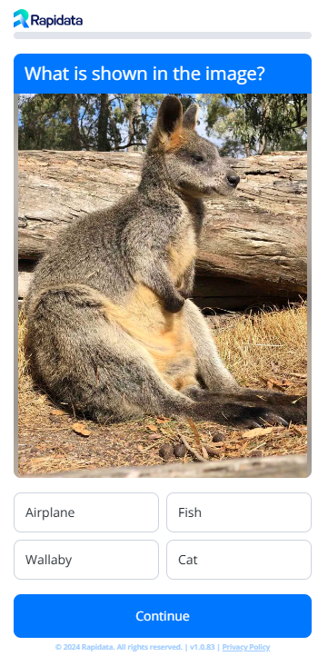

# Quickstart Classification Guide

Directly ask real humans to classify your data. This guide will show you how to create a classification order using the Rapidata API.

We will create an order, specify what question and answer options we want to have, as well as upload the data we want to classify.

Our annotators will then label the data according to the question and answer options we provided.

They see the following screen:



## Installation

Install Rapidata using pip:

```
pip install -U rapidata
```


## Usage

Orders are managed through the `RapidataClient`.

Create a client as follows:

```py
from rapidata import RapidataClient

#first time executing it on a machine will require you to log in
rapi = RapidataClient()
```
### Creating an Order

1. Create a new `Classification Order` and specify the name:

```py
order_builder = rapi.create_classify_order("Example Classification Order")
```

2. Add the question you want to ask.

```py
order_builder = order_builder.question("What is shown in the image?")
```

3. add the different answer options (order will be randomized):

```py
order_builder = order_builder.options(["Fish", "Cat", "Wallaby", "Airplane"])
```

4. Add the paths to the images you want to classify:

```py
order_builder = order_builder.media(["examples/data/wallaby.jpg"])
```

5. Optionally add additional specifications, here we're adding a specific amount of responses<sup>1</sup> we want per datapoint, there are other functionalities you can explore:

```py
order_builder = order_builder.responses(20)
```

6. Finally create the order. This sends the order off for verification and will start collecting responses.

```py
order = order_builder.create()
```

7. You can see your orders on the [Rapidata Dashboard](https://app.rapidata.ai/dashboard/orders).


### Short Form

The `RapidataSDK` supports a fluent interface, allowing method call chaining. This enables a more concise order creation:

```py
order = (rapi.create_classify_order("Example Classification Order")
         .question("What is shown in the image?")
         .options(["Fish", "Cat", "Wallaby", "Airplane"])
         .media(["examples/data/wallaby.jpg"])
         .responses(20)
         .create())
```

### Retrieve Orders

To Retrieve old orders, you can use the `find_orders` method. This method allows you to filder by name and amount of orders to retrieve:

```py
example_orders = rapi.find_orders("Example Classification Order")

# if no name is provided it will just return the most recent one
most_recent_order = rapi.find_orders()[0]
```

### Monitoring Order Progress

You can monitor the progress of the order on the [Rapidata Dashboard](https://app.rapidata.ai/dashboard/orders) or by checking how many datapoints are already done labeling (keep in mind that this will be an exponential function since the datapoints get picket at random to be labeled):

```py
order.display_progress_bar()
```

### Downloading Results

To download the results simply call the `get_results` method on the order:

```py
results = order.get_results()
```
---

<sup>1</sup> Due to the possibility of multiple people answering at the same time, this number is treated as a minimum. The actual number of responses may be higher. The overshoot per datapoint will be lower the more datapoints are added.
