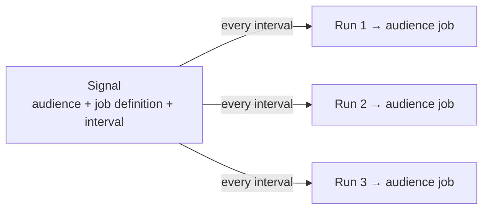

# Signals

A **signal** runs a labeling job on a repeating schedule. Instead of assigning a
job once and waiting for results, you bind a [job definition](job_definition_parameters.md)
to an [audience](audiences.md) and an interval — and Rapidata creates a fresh
labeling job for you on every tick, automatically.

## What a signal is

A signal ties together three things:

- an **audience** — who labels the data,
- a **job definition** — what they are asked to do (the task, datapoints, settings),
- an **interval** — how often it fires (in seconds, minimum 60).

Each time the interval elapses, the signal fires and produces a **run**
(`SignalRun`). A run represents one execution: it spawns a single audience job
from the job definition and tracks it through to completion.



## When to use it

Reach for a signal whenever you want labeling to happen **continuously and
unattended** rather than as a single one-off job:

- **Recurring data collection** — re-run the same task on a fresh batch every day/hour.
- **Ongoing model monitoring** — periodically gather human judgments on your model's latest outputs.
- **Scheduled evaluation** — keep a benchmark fed with new human votes over time.

If you just need labels once, assign a job directly to an audience instead
(see [Custom Audiences](audiences.md)) — you don't need a signal.

## Creating a signal

You need an audience id and a job definition id. Both are created the same way
you would for a normal job:

```py
from rapidata import RapidataClient

client = RapidataClient()

audience = client.audience.create_audience(name="Prompt Alignment Audience")

job_definition = client.job.create_compare_job_definition(
    name="Prompt Alignment Job",
    instruction="Which image follows the prompt more accurately?",
    datapoints=[
        ["https://assets.rapidata.ai/flux_book.jpg",
         "https://assets.rapidata.ai/mj_book.jpg"]
    ],
    contexts=["A small blue book sitting on a large red book."],
)

signal = client.signals.create(
    name="Daily prompt alignment",
    audience_id=audience.id,
    job_definition_id=job_definition.id,
    interval_seconds=86_400,  # (1)!
)

print(signal)
print("First run scheduled for:", signal.next_run_at)
```

1. Fires once per day. The minimum interval is 60 seconds.

By default the signal follows the **latest** revision of the job definition at
fire time. Pin it to a fixed revision with `revision_number=...`, and make it
discoverable by other users in your organization with `is_public=True`.

## Runs and their lifecycle

Every firing — scheduled or manual — produces a `SignalRun`. A run moves
through these statuses:

| Status | Meaning |
|---|---|
| `Pending` | The run has been created but the audience job hasn't started yet. |
| `Running` | The audience job is live and collecting labels. |
| `Completed` | The audience job finished successfully. |
| `Failed` | The run failed (see `failure_message`). |
| `Skipped` | The firing was skipped without creating a job (see `skipped_reason`). |

`Completed`, `Failed` and `Skipped` are **terminal**. Two convenience
properties make this easy to check:

```py
run.is_terminal  # True once the run has finished (any terminal status)
run.succeeded    # True only when the run Completed
```

List the runs a signal has produced (newest first by default):

```py
for run in signal.get_runs(page_size=10):
    print(run.started_at, run.status, run.audience_job_id)
```

## Triggering a run on demand

You don't have to wait for the schedule — fire one extra run immediately. This
is the easiest way to test a signal end to end:

```py
signal.trigger()  # (1)!

run = signal.wait_for_next_run(timeout=600)  # (2)!
print("Run finished with status:", run.status)
```

1. `trigger()` returns `None` — the run is created asynchronously on the backend.
2. Blocks until the next run (the one you just triggered, or the next scheduled one) reaches a terminal status. Raises `TimeoutError` if none finishes in time.

## Getting the labeling results of a run

A run spawns a normal audience job. Once the run is terminal, use its
`audience_job_id` to fetch that job and read its [results](understanding_the_results.md):

```py
run = signal.wait_for_next_run()

if run.succeeded and run.audience_job_id:
    job = client.job.get_job_by_id(run.audience_job_id)
    results = job.get_results()
    print(results)
```

## Managing a signal

```py
signal.pause()    # stop firing scheduled runs
signal.resume()   # resume the schedule

signal.update(    # change mutable fields (omit any you don't want to change)
    name="Hourly prompt alignment",
    interval_seconds=3_600,
)

signal.refresh()  # re-fetch the latest server-side state
signal.delete()   # stop the signal for good (existing runs/jobs are unaffected)
```

Look signals up later through the manager:

```py
signal = client.signals.get("signal_id")        # by id
signals = client.signals.list(page_size=20)      # your signals + public ones
run = client.signals.get_run("run_id")            # a run when you don't know its signal
```

## Property reference

A `RapidataSignal` exposes:

| Property | Description |
|---|---|
| `id` | The signal's unique id. |
| `name` / `description` | Display name and optional description. |
| `audience_id` | The audience each run targets. |
| `job_definition_id` | The job definition each run is created from. |
| `revision_number` | Pinned job-definition revision, or `None` for "latest at fire time". |
| `interval_seconds` | How often the signal fires. |
| `next_run_at` / `last_run_at` | Timestamps of the next and most recent runs. |
| `is_paused` | Whether the scheduler is currently skipping this signal. |
| `is_public` | Whether other users can discover and read it. |
| `created_at` | When the signal was created. |

## Next Steps

- Set up the [audience](audiences.md) that will label each run.
- Choose the task and tune the [job definition parameters](job_definition_parameters.md).
- Learn how to read a run's [results](understanding_the_results.md).
