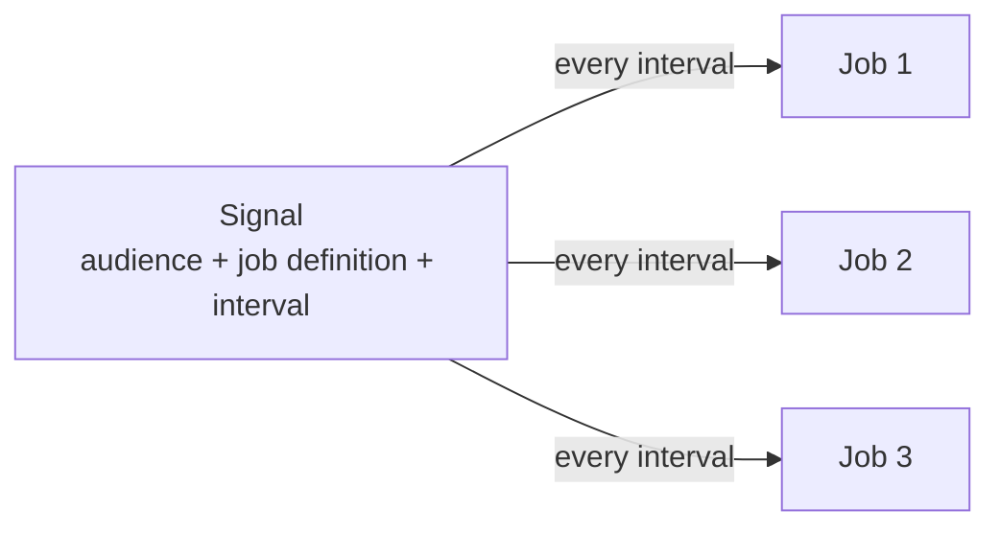

# Signals

A **signal** runs the same labeling job on a repeating schedule: bind a
[job definition](job_definition_parameters.md) to an [audience](audiences.md)
and an interval, and Rapidata creates a new [job](understanding_the_results.md)
on every tick.

## What a signal is

A signal ties together three things:

- an **audience** — who labels the data,
- a **job definition** — the task that gets run,
- an **interval** — how often it fires, in hours.

Each firing creates one `RapidataJob`, identical to a job you create directly.
A signal is just a scheduler that keeps producing those jobs; every job runs the
same job definition against the same audience.



## Creating a signal

```py
from rapidata import RapidataClient

client = RapidataClient()

audience = client.audience.get_audience_by_id("aud_MU1GZYoESyO")

job_definition = client.job.create_compare_job_definition(
    name="Prompt Alignment Job",
    instruction="Which image follows the prompt more accurately?",
    datapoints=[
        ["https://assets.rapidata.ai/flux_book.jpg",
         "https://assets.rapidata.ai/mj_book.jpg"]
    ],
    contexts=["A small blue book sitting on a large red book."],
)

signal = client.signals.create_signal(
    name="Daily prompt alignment",
    audience=audience,
    job_definition=job_definition,
    interval_hours=24,
)
```

`audience` and `job_definition` also accept id strings. By default the signal
uses the latest revision of the job definition at fire time; pin one with
`revision_number=...`. Set `is_public=True` to let others in your organization
read the signal.

## The jobs a signal creates

Every firing creates a `RapidataJob`:

```py
for job in signal.get_jobs(page_size=10):
    print(job, job.get_status())

results = signal.get_jobs(page_size=1)[0].get_results()
```

A firing can be skipped (for example if the previous job hasn't finished). A
skipped firing creates no job and won't appear in `get_jobs()`.

## Triggering a job on demand

Fire one job immediately instead of waiting for the schedule:

```py
signal.trigger()
job = signal.wait_for_next_job(timeout=600)
print(job.get_results())
```

`trigger()` returns right away; the job is created in the background.
`wait_for_next_job()` blocks until the next firing has created its job and
returns it.

## Managing a signal

```py
signal.pause()
signal.resume()
signal.update(name="Hourly prompt alignment", interval_hours=1)
signal.delete()
```

Reading a property re-fetches the current server state, so there's nothing to
refresh after a change or a scheduled firing.

Look signals up later:

```py
signal = client.signals.get_signal_by_id("signal_id")
signals = client.signals.find_signals(name="alignment")
```

## Property reference

| Property | Description |
|---|---|
| `id` | The signal's unique id. |
| `name` / `description` | Display name and optional description. |
| `audience_id` | The audience each job targets. |
| `job_definition_id` | The job definition each job is created from. |
| `revision_number` | Pinned job-definition revision, or `None` for "latest at fire time". |
| `interval_hours` | How often the signal fires, in hours. |
| `next_run_at` / `last_run_at` | Timestamps of the next and most recent firings. |
| `is_paused` | Whether the scheduler is currently skipping this signal. |
| `is_public` | Whether other users can discover and read it. |
| `created_at` | When the signal was created. |
