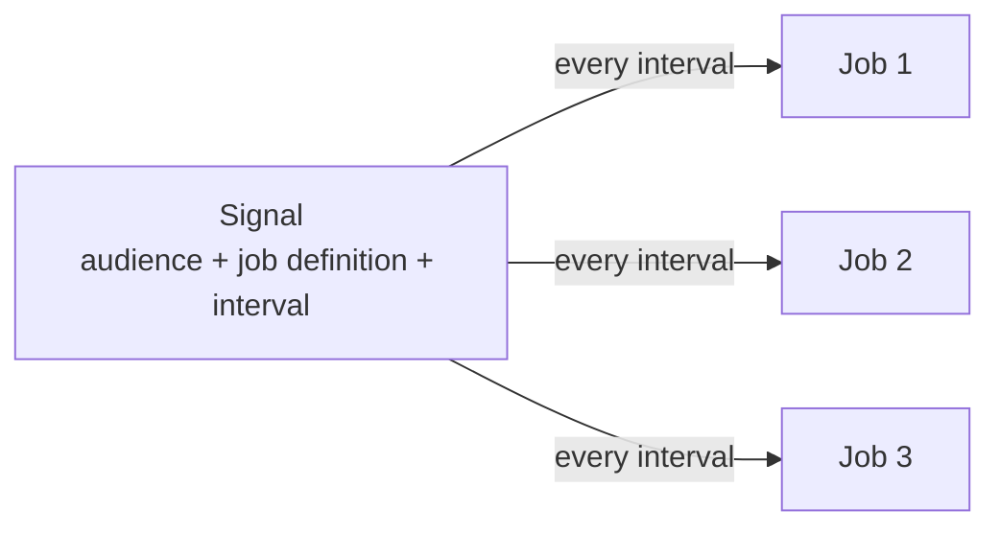

# Signals

A **signal** runs a labeling job on a repeating schedule. Instead of assigning a
job once, you bind a [job definition](job_definition_parameters.md) to an
[audience](audiences.md) and an interval — and Rapidata creates a fresh
[job](examples/classify_job.md) for you on every tick, automatically.

## What a signal is

A signal ties together three things:

- an **audience** — who labels the data,
- a **job definition** — what they are asked to do (the task, datapoints, settings),
- an **interval** — how often it fires (in hours).

Each time the interval elapses, the signal fires and creates one **job** — an
ordinary [`RapidataJob`](understanding_the_results.md), exactly like one you'd
assign by hand, with the same `get_status()`, `get_results()` and
`display_progress_bar()`. A signal is simply a scheduler that keeps producing
jobs for you.



## When to use it

Reach for a signal whenever you want labeling to happen **continuously and
unattended** rather than as a single one-off job:

- **Recurring data collection** — re-run the same task on a fresh batch every day/hour.
- **Ongoing model monitoring** — periodically gather human judgments on your model's latest outputs.
- **Scheduled evaluation** — keep a benchmark fed with new human votes over time.

If you just need labels once, assign a job directly to an audience instead
(see [Custom Audiences](audiences.md)) — you don't need a signal.

## Creating a signal

Create an audience and a job definition the same way you would for a normal job,
then hand them to the signal:

```py
from rapidata import RapidataClient

client = RapidataClient()

audience = client.audience.create_audience(name="Prompt Alignment Audience")

job_definition = client.job.create_compare_job_definition(
    name="Prompt Alignment Job",
    instruction="Which image follows the prompt more accurately?",
    datapoints=[
        ["https://assets.rapidata.ai/flux_book.jpg",
         "https://assets.rapidata.ai/mj_book.jpg"]
    ],
    contexts=["A small blue book sitting on a large red book."],
)

signal = client.signals.create_signal(
    name="Daily prompt alignment",
    audience=audience,                # (1)!
    job_definition=job_definition,
    interval_hours=24,                # (2)!
)

print(signal)
print("First job scheduled for:", signal.next_run_at)
```

1. Pass the `RapidataAudience` / `RapidataFilteredAudience` and `RapidataJobDefinition` objects directly, or their id strings if that's what you have.
2. Fires once per day.

By default the signal follows the **latest** revision of the job definition at
fire time. Pin it to a fixed revision with `revision_number=...`, and make it
discoverable by other users in your organization with `is_public=True`.

## The jobs a signal creates

Every firing creates a `RapidataJob`. List the jobs a signal has produced
(newest first by default) and work with them like any other job:

```py
for job in signal.get_jobs(page_size=10):
    print(job, job.get_status())

latest = signal.get_jobs(page_size=1)[0]
results = latest.get_results()   # blocks until that job is complete
```

!!! note
    A firing can occasionally be **skipped** (for example if the previous job
    hasn't finished yet) — a skipped firing creates no job and therefore doesn't
    appear in `get_jobs()`.

## Triggering a job on demand

You don't have to wait for the schedule — fire one extra job immediately. This
is the easiest way to test a signal end to end:

```py
signal.trigger()                                # (1)!

job = signal.wait_for_next_job(timeout=600)     # (2)!
job.display_progress_bar()
print(job.get_results())
```

1. `trigger()` returns `None` — the job is created asynchronously on the backend.
2. Blocks until the next firing (the one you just triggered, or the next scheduled one) has created its job, then returns that live `RapidataJob`. Raises `TimeoutError` if none appears in time.

## Managing a signal

```py
signal.pause()    # stop firing scheduled jobs
signal.resume()   # resume the schedule

signal.update(    # change mutable fields (omit any you don't want to change)
    name="Hourly prompt alignment",
    interval_hours=1,
)

signal.delete()   # stop the signal for good (jobs it already created are unaffected)
```

A `RapidataSignal` is a **live handle** — reading a property like `is_paused`
or `next_run_at` always reflects the current server state, so there's nothing to
refresh after `pause()`, `update()`, or a scheduled firing.

Look signals up later through the manager:

```py
signal = client.signals.get_signal_by_id("signal_id")   # by id
signals = client.signals.find_signals(name="alignment") # your signals + public ones
```

## Property reference

A `RapidataSignal` exposes (mutable properties are re-fetched live on access):

| Property | Description |
|---|---|
| `id` | The signal's unique id. |
| `name` / `description` | Display name and optional description. |
| `audience_id` | The audience each job targets. |
| `job_definition_id` | The job definition each job is created from. |
| `revision_number` | Pinned job-definition revision, or `None` for "latest at fire time". |
| `interval_hours` | How often the signal fires, in hours. |
| `next_run_at` / `last_run_at` | Timestamps of the next and most recent firings. |
| `is_paused` | Whether the scheduler is currently skipping this signal. |
| `is_public` | Whether other users can discover and read it. |
| `created_at` | When the signal was created. |

## Next Steps

- Set up the [audience](audiences.md) that will label each job.
- Choose the task and tune the [job definition parameters](job_definition_parameters.md).
- Learn how to read a job's [results](understanding_the_results.md).
